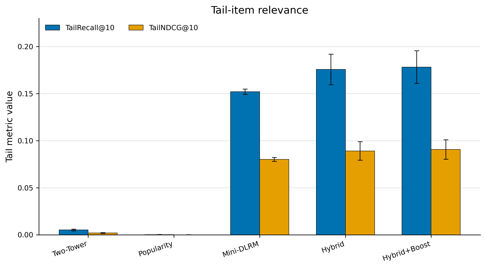
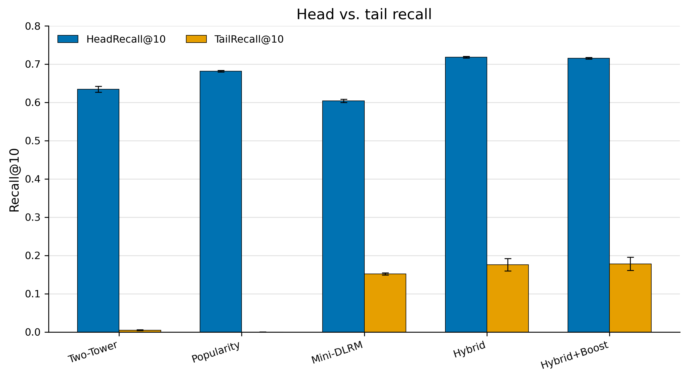
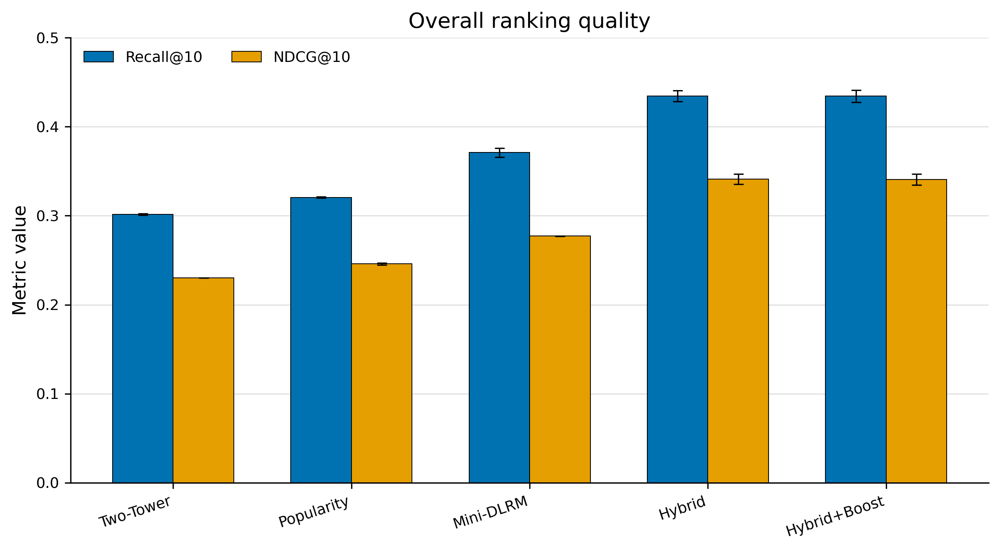
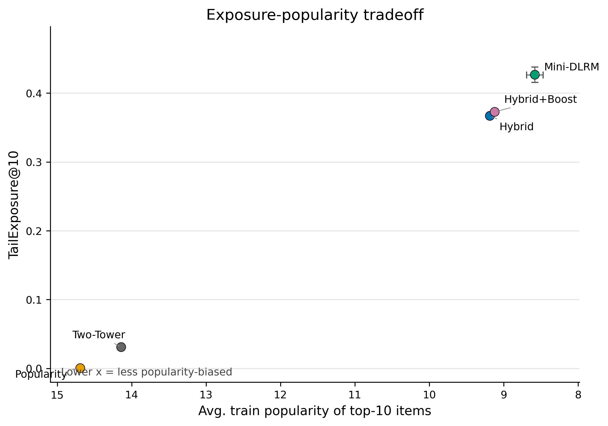

# Semantic Priors for Sparse Long-Tail Recommendation

## Overview

Sparse long-tail recommendation is hard because many items have weak collaborative signals. Popularity and ID-based recommenders often over-serve head items, while sparse and tail items receive too little signal to learn stable collaborative embeddings.

This project asks a focused empirical question:

> Can semantic item priors improve sparse long-tail recommendation beyond pure collaborative filtering?

The hypothesis is that frozen semantic item embeddings from product title/category/description can provide useful priors for sparse and tail items. The experiment keeps a compact DLRM-style interaction backbone fixed and isolates the effect of adding semantic item embeddings through a projection layer. This is a controlled empirical study of semantic priors, not a claim of a new production recommender architecture.

## Research Questions

1. Do semantic item priors improve overall sampled ranking quality?
2. Do they improve tail-item relevance more than head-item relevance?
3. How do popularity bias and tail exposure change across models?
4. Do semantic priors remain useful when sampled retrieval becomes harder?

## Experimental Design

Dataset: Amazon Reviews 2023 `Movies_and_TV`.

Main protocol: multi-positive sampled ranking with 3 held-out positives and 99 sampled non-interacted negatives per eligible user.

Stress test: the same 3-positive protocol with 499 sampled negatives.

Models:

| Model | Role |
|---|---|
| Popularity | non-personalized head-demand baseline |
| Two-Tower | ID-only collaborative baseline |
| Mini-DLRM | compact DLRM-style interaction backbone |
| Hybrid Mini-DLRM + Semantic | Mini-DLRM plus frozen MiniLM item-text embeddings |
| Hybrid + inverse-popularity boost | post-ranking exploration heuristic |

Training uses a standard BCE sampled pointwise ranking objective. Evaluation reports Recall@10, HitRate@10, NDCG@10, HeadRecall@10, TailRecall@10, TailNDCG@10, TailExposure@10, and AvgTrainPopularity@10.

## Main Result: Semantic Priors Improve Sparse Tail Generalization

Final main benchmark: `num_test_positives=3`, `eval_negatives=99`, `K=10`, seeds 42/43/44, `epochs=5`, `lr=1e-3`, `emb_dim=32`, and `train_negatives=8`.

The original filtered subset contains 13,509 users, 20,896 items, and 138,919 positive interactions. Under the fixed multi-positive protocol, users without enough history for train, validation, and 3 test positives are excluded from evaluation, leaving the eligible population below.

| Setting | Value |
|---|---:|
| Eligible users | 4,899 |
| Eligible items | 19,707 |
| Positive interactions | 138,919 |
| Sparsity | 0.99856 |
| Minimum user interactions | 5 |
| Minimum item interactions | 2 |
| Eval protocol | 3 positives + 99 negatives |
| NumHeadEvalUsers mean | 3,834 |
| NumTailEvalUsers mean | 4,132 |
| NumHeadEvalPositives mean | 6,843 |
| NumTailEvalPositives mean | 7,854 |

| Model | Recall@10 | HitRate@10 | NDCG@10 | HeadRecall@10 | HeadNDCG@10 | TailRecall@10 | TailHitRate@10 | TailNDCG@10 | TailExposure@10 | AvgTrainPopularity@10 |
|---|---:|---:|---:|---:|---:|---:|---:|---:|---:|---:|
| Two-Tower | 0.301456 | 0.615126 | 0.230036 | 0.634455 | 0.404431 | 0.005183 | 0.009681 | 0.001984 | 0.030966 | 14.141478 |
| Popularity | 0.320576 | 0.636967 | 0.245931 | 0.681512 | 0.435126 | 0.000202 | 0.000363 | 0.000071 | 0.000388 | 14.691437 |
| Mini-DLRM | 0.370926 | 0.705042 | 0.277062 | 0.604134 | 0.397169 | 0.152085 | 0.259439 | 0.080227 | 0.426628 | 8.582466 |
| Hybrid Mini-DLRM + Semantic | 0.434306 | 0.767810 | 0.341041 | 0.718288 | 0.505856 | 0.175722 | 0.284729 | 0.089091 | 0.366850 | 9.187212 |
| Hybrid + inverse-popularity boost alpha=0.15 | 0.434340 | 0.767197 | 0.340624 | 0.715289 | 0.503142 | 0.178243 | 0.288238 | 0.090643 | 0.372658 | 9.122362 |

Popularity captures head demand but nearly fails on tail items. Two-Tower struggles because pure ID embeddings generalize poorly in sparse regimes. Mini-DLRM improves over simple baselines through feature interactions. The semantic-augmented Mini-DLRM improves both overall ranking and tail relevance.

The key evidence is tail relevance:

| Comparison | Mini-DLRM | Hybrid |
|---|---:|---:|
| TailRecall@10 | 0.152085 | 0.175722 |
| TailNDCG@10 | 0.080227 | 0.089091 |

These results support the central claim: frozen MiniLM item-text embeddings provide useful semantic priors when collaborative item signals are sparse.

## Robustness: Harder Sampled Retrieval

This is not the main benchmark. It is a stress test with a much larger sampled candidate set: each eligible user ranks 3 held-out positive items against 499 sampled non-interacted negatives. Absolute scores are lower because the top-10 ranking task is substantially harder.

| Setting | Value |
|---|---:|
| Eligible users | 4,899 |
| Eligible items | 19,707 |
| Positive interactions | 138,919 |
| Sparsity | 0.998561 |
| Eval protocol | 3 positives + 499 negatives |
| NumHeadEvalUsers mean | 3,834 |
| NumTailEvalUsers mean | 4,132 |
| NumHeadEvalPositives mean | 6,843 |
| NumTailEvalPositives mean | 7,854 |

| Model | Recall@10 | HitRate@10 | NDCG@10 | HeadRecall@10 | HeadNDCG@10 | TailRecall@10 | TailHitRate@10 | TailNDCG@10 | TailExposure@10 | AvgTrainPopularity@10 |
|---|---:|---:|---:|---:|---:|---:|---:|---:|---:|---:|
| Mini-DLRM | 0.179084 | 0.414983 | 0.132253 | 0.369718 | 0.229910 | 0.007160 | 0.014037 | 0.003308 | 0.047714 | 18.452878 |
| Hybrid Mini-DLRM + Semantic | 0.202626 | 0.461523 | 0.150502 | 0.389976 | 0.247414 | 0.031885 | 0.059656 | 0.016594 | 0.157726 | 14.273791 |
| Hybrid + inverse-popularity boost alpha=0.15 | 0.202082 | 0.459992 | 0.149852 | 0.387585 | 0.245234 | 0.033196 | 0.061834 | 0.017449 | 0.165411 | 14.128322 |

Mini-DLRM tail relevance collapses more strongly when the candidate set becomes larger. Hybrid retains stronger tail relevance: TailRecall@10 improves from 0.007160 to 0.031885 and TailNDCG@10 improves from 0.003308 to 0.016594. This suggests semantic priors become more important as collaborative retrieval difficulty increases.

## Exposure and Popularity Bias

TailExposure@10 measures how many top-10 recommendation slots go to tail items. AvgTrainPopularity@10 measures the average train interaction count of recommended items, so lower values indicate less popularity-biased recommendations.

The inverse-popularity boost is a post-ranking exploration heuristic, not a new model. It is useful for studying the relevance/exposure tradeoff:

| Metric | Hybrid | Hybrid + Boost |
|---|---:|---:|
| TailRecall@10 | 0.175722 | 0.178243 |
| TailNDCG@10 | 0.089091 | 0.090643 |
| TailExposure@10 | 0.366850 | 0.372658 |
| AvgTrainPopularity@10 | 9.187212 | 9.122362 |

The effect is intentionally modest: the boost slightly shifts exposure toward less popular items and slightly improves tail relevance, while overall ranking quality remains nearly unchanged. It should not be interpreted as a production cold-start solution.

## Why Multi-positive Evaluation?

Single-positive leave-one-out evaluation is common, but it can be noisy because each user contributes only one relevant held-out item. Users often have multiple relevant items, especially in product recommendation settings. Multi-positive evaluation better captures a user preference distribution by ranking several held-out positives against sampled negatives.

The single-positive benchmark is retained only for compatibility. In that setting, Recall@K and HitRate@K are equivalent because each user has exactly one held-out positive.

## Single-positive Compatibility Benchmark

This earlier compatibility result uses the original 13,509-user, 20,896-item filtered population with 1 held-out positive item plus 99 negatives per user. It is not the main project result.

| Model | Recall@10 | NDCG@10 | HeadRecall@10 | TailRecall@10 | TailNDCG@10 | TailExposure@10 | AvgTrainPopularity@10 |
|---|---:|---:|---:|---:|---:|---:|---:|
| Two-Tower | 0.363424 | 0.216993 | 0.700602 | 0.003596 | 0.001116 | 0.019172 | 22.715645 |
| Popularity | 0.383152 | 0.230059 | 0.742042 | 0.000153 | 0.000046 | 0.000596 | 23.318332 |
| Mini-DLRM | 0.413835 | 0.242458 | 0.665974 | 0.144759 | 0.061567 | 0.394333 | 14.313709 |
| Hybrid Mini-DLRM + Semantic | 0.465727 | 0.280997 | 0.745698 | 0.166947 | 0.070298 | 0.348845 | 14.923451 |
| Hybrid + inverse-popularity boost alpha=0.15 | 0.465282 | 0.280582 | 0.741898 | 0.170084 | 0.071741 | 0.355037 | 14.814953 |

## Architecture

The Hybrid model does not replace the ranking backbone; it augments the item representation. Mini-DLRM and Hybrid share the same DLRM-style feature interaction backbone. The controlled difference is the frozen semantic item embedding table plus a trainable semantic projection layer.

```text
Amazon Reviews interactions          Product metadata text
        |                                     |
        v                                     v
 user_id, item_id                      title/category/description
        |                                     |
        v                                     v
 collaborative embeddings        frozen MiniLM/e5/BGE embeddings
        |                                     |
        |                          semantic projection layer
        |                                     |
        +----------- DLRM-style feature interaction --------+
                                      |
                                      v
                              ranking logit / score
```

Only recommender embeddings, dense feature layers, semantic projection, interaction layers, and the top MLP are trained. The semantic embedding table is frozen.

## Visualizations

### Tail Relevance Metrics



This is the main evidence figure: Popularity and Two-Tower nearly fail on tail relevance, while Hybrid improves TailRecall and TailNDCG over Mini-DLRM.

### Head vs Tail Recall



This view shows the head-tail imbalance directly. It supports the interpretation that semantic priors help tail generalization without replacing the collaborative ranking backbone.

### Overall Ranking Metrics



Hybrid improves general ranking quality, while Mini-DLRM improves over simpler collaborative baselines.

### Exposure vs Popularity Tradeoff



This figure separates exposure from relevance. Mini-DLRM produces high tail exposure but weaker tail relevance; Hybrid balances relevance and exposure more effectively. Hybrid + Boost slightly shifts toward less popularity-biased recommendations.

Regenerate the figures with:

```bash
python scripts/plot_final_results.py
```

## Current Recommended Configuration

```text
Model: Hybrid Mini-DLRM + Semantic
Semantic encoder: sentence-transformers/all-MiniLM-L6-v2
epochs: 5
lr: 1e-3
emb_dim: 32
train_negatives: 8
eval_negatives: 99
num_test_positives: 3 for main evaluation
optional exploration boost: inverse_popularity alpha=0.15
```

## Main Findings

1. Semantic priors improve sparse long-tail recommendation.
2. Popularity is competitive overall only because it captures head demand.
3. ID-only Two-Tower fails to generalize to tail items.
4. Mini-DLRM improves ranking through feature interactions.
5. Hybrid improves both overall quality and tail relevance by injecting semantic item priors.
6. The 499-negative stress test suggests semantic priors are more robust under harder sampled retrieval.
7. Inverse-popularity boost provides a small exposure/relevance tradeoff, not a new model.
8. The project is a controlled study, not a claim of production-scale DLRM or full-catalog retrieval.

## Earlier Exploratory Results

Earlier experiments were useful for shaping the final protocol, but they are not the current main result.

| Observation | Result |
|---|---|
| Tiny dense regime | Semantic Hybrid did not help much because collaborative repetition dominated. |
| Earlier 49k sparse subset | Hybrid MiniLM improved over Mini-DLRM and showed better stability. |
| Earlier BGE-small tuning | BGE was promising on a smaller subset after encoder-specific tuning. |
| Earlier negative sampling | `train_negatives=12` was strong before scaling; `train_negatives=8` is better in the final 138k run. |

MiniLM is the current main encoder for the fixed benchmark. BGE is retained as historical context, not claimed as the final best model.

## Quick Start

Install dependencies:

```bash
python -m venv .venv
source .venv/bin/activate
pip install -r requirements.txt
```

Run the notebook with synthetic fallback data:

```bash
jupyter notebook notebooks/01_amazon_semantic_hybrid_recommender.ipynb
```

Build the current 138k-scale subset:

```bash
python scripts/build_real_subset.py \
  --max-review-rows 2000000 \
  --max-metadata-rows 2500000 \
  --target-items 20000 \
  --target-interactions 200000 \
  --selection-mode long_tail \
  --min-user-interactions 5 \
  --min-item-interactions 2
```

Run the current main benchmark:

```bash
python scripts/run_ablation.py \
  --run-name movies_tv_138k_multipos3_main \
  --models mini_dlrm,hybrid \
  --seeds 42,43,44 \
  --epochs 5 \
  --learning-rates 0.001 \
  --embedding-dims 32 \
  --train-negatives 8 \
  --eval-negatives 99 \
  --num-test-positives 3 \
  --batch-size 4096 \
  --semantic-model sentence-transformers/all-MiniLM-L6-v2 \
  --cold-start-boost-mode inverse_popularity \
  --cold-start-boost-alpha 0.15
```

For real-data setup details, see [docs/RUN_REAL_DATA.md](docs/RUN_REAL_DATA.md).

## Repository Structure

```text
notebooks/   Main runnable experiment and reporting notebook
src/         Reusable data, sampling, metrics, model, training, reranking, and semantic modules
scripts/     Real-data subset builder, smoke checks, ablation runner, and plotting script
data/        Local raw/processed/embedding files; ignored except .gitkeep files
results/     Local generated metrics and final tracked figures
```

## Dataset Format

Review files may be CSV, JSON, JSONL, NDJSON, or parquet. Common Amazon Reviews aliases are normalized:

```text
user: reviewerID, user_id, user
item: parent_asin, asin, item_id
time: unixReviewTime, timestamp, time
rating: overall, rating
```

Optional metadata fields:

```text
parent_asin or asin
title
main_category
categories
description
price
average_rating
rating_number
```

`parent_asin` is preferred as the canonical item id when present; otherwise the code falls back to `asin` or `item_id`.

## Limitations

- Evaluation uses sampled candidate ranking, not full-catalog retrieval.
- The 499-negative stress test is still sampled evaluation, not full-catalog retrieval.
- The project does not include sequential user modeling.
- The project does not include graph-based collaborative modeling.
- The project does not implement a production retrieval/reranking stack.
- Semantic encoders are frozen rather than fine-tuned.
- The inverse-popularity boost is a heuristic exposure analysis, not a production exploration system.

## Future Work

- Hard negative mining
- Popularity-aware negative sampling
- Full-catalog ANN retrieval with Faiss or ScaNN
- SASRec or BERT4Rec sequence modeling
- Graph-based recommendation models
- Multimodal product embeddings
- Fine-tuning semantic encoders on recommendation pairs

## References and Resources

- [Amazon Reviews 2023 dataset](https://huggingface.co/datasets/McAuley-Lab/Amazon-Reviews-2023), McAuley Lab
- DLRM-style recommendation models with sparse embeddings, dense features, and feature interactions
- Semantic embedding models: MiniLM, e5, and BGE
- Long-tail recommendation research on sparse feedback and popularity skew
- [Negative Sampling in Recommendation: A Survey and Future Directions](https://dl.acm.org/doi/10.1145/3793855), ACM Digital Library
